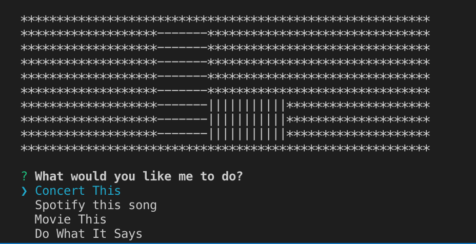

# liri_node_app
A node app using Inquirer that can search for songs, concerts, and movies

**This project uses APIs:**
 Spotify, moment, Bands in Town, 

**and NPM packages:**
dotenv, axios, inquirer, moment, fs, and opn

This project is useful for quick concert references, playing that song that pops in your head, or quick movie info look ups.  It can also read a text file to automate multiple tasks at once and logs all activity of the user with a search history.

You can get started by simply adding your own **.env** file and calling node liri.js in the command terminal.

This project is contributed to and maintained by **Matthew Madison**

## WALKTHROUGH

Liri opens up with a basic prompt asking you what you want to do.

