# liri_node_app
A node app using Inquirer that can search for songs, concerts, and movies

**This project uses APIs:**
 Spotify, moment, Bands in Town, 

**and NPM packages:**
dotenv, axios, inquirer, moment, fs, and opn

This project is useful for quick concert references, playing that song that pops in your head, or quick movie info look ups.  It can also read a text file to automate multiple tasks at once and logs all activity of the user with a search history.

You can get started by simply adding your own **.env** file and calling node liri.js in the command terminal.

This project is contributed to and maintained by **Matthew Madison**

## WALKTHROUGH

Liri opens up with a basic prompt asking you what you want to do.
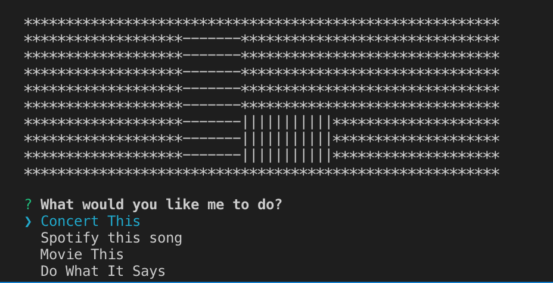

Lets choose **Concert This**.  As soon as you select "Concert This" this you will be prompted to enter a band name.  If you choose nothing it will default to Maroon5 and display all concerts coming up.  Otherwise it will display Name, Location, and Date of all concerts of the band of your choice.  It will also log your search activity to log.tex
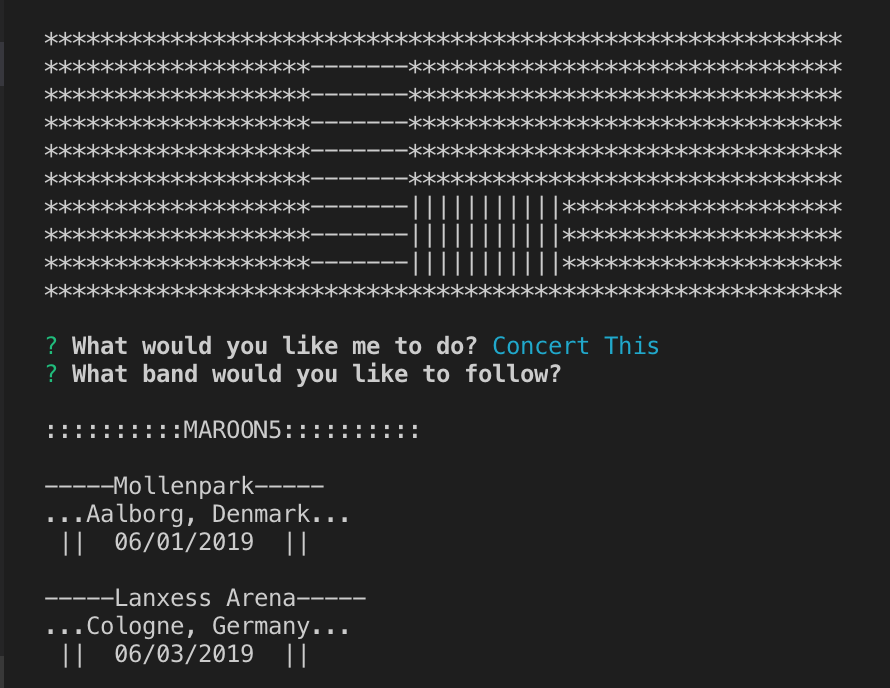
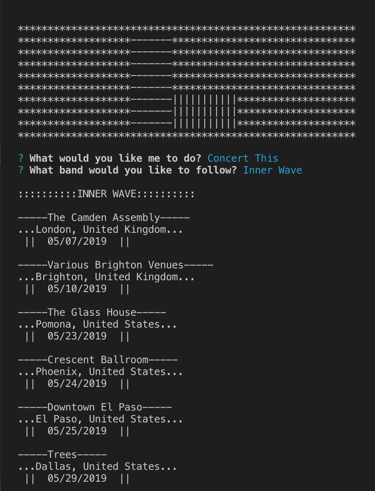

Lets choose **Spotify this song**.  As soon as you select "Spotify this song" this you will be prompted to enter a song name.  If you choose nothing it will default to Biking by Frank Ocean.  Once a song is chosen it opens up a spotify window, console logs the artist, song name, preview link, and album.  It will also log your search activity to log.txt.
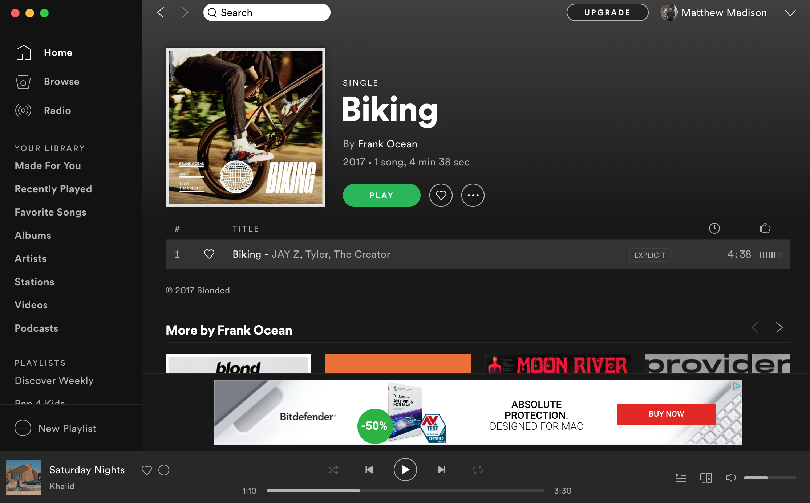
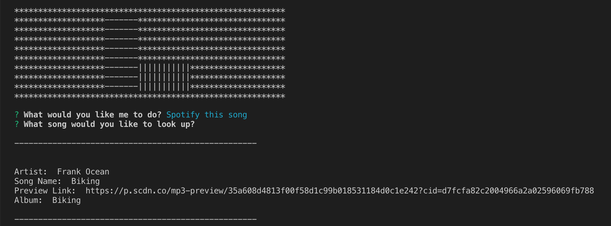

Lets choose **Movie this**.  As soon as you select "Movie This" this you will be prompted to enter a movie name.  If you choose nothing it will default to Mr. Nobody.  Once a movie is chosen it console logs the movie's title, release date, imdb rating, rotten tomato rating, country produced in, main language, plot, and actors. It will also log your search activity to log.txt.
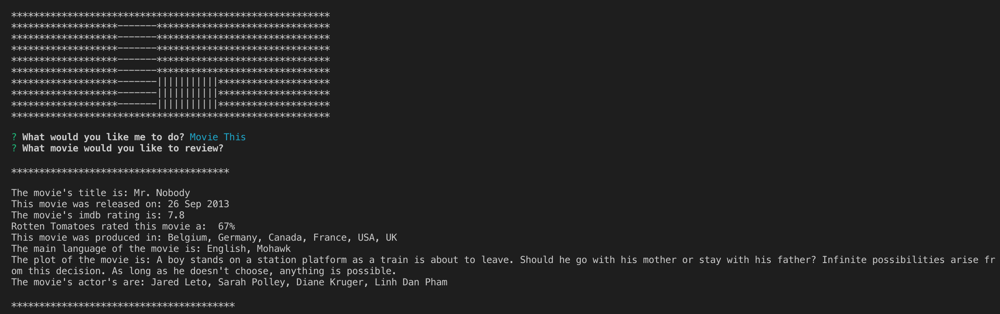
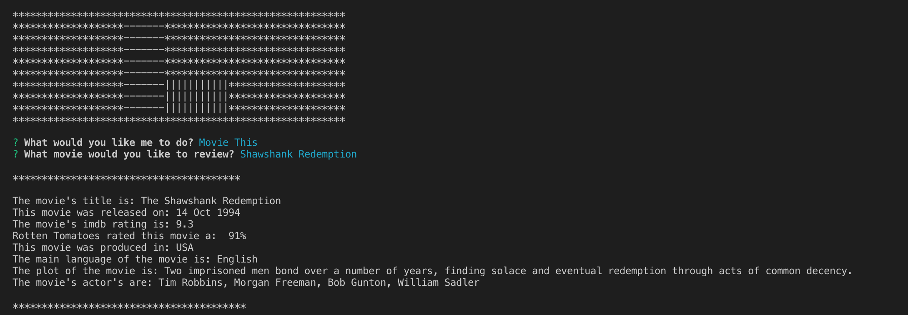

Lets choose **Do What It Says**.  As soon as you select "Do What it says" Liri will read the random.txt file and search for commands.  If it finds a command it will run the next criteria as the search.  Liri will continue to run any and every command in the random.txt file.  It will also log your search activity to log.txt.
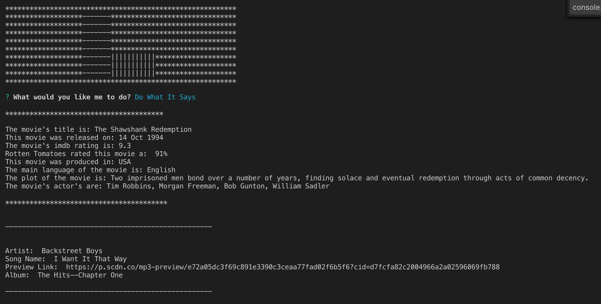
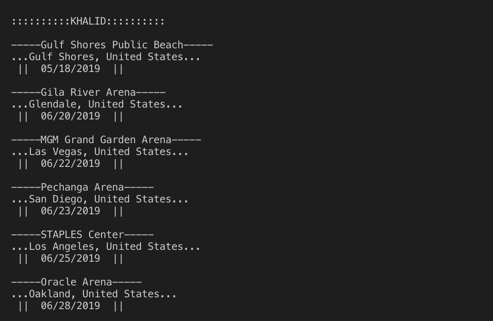
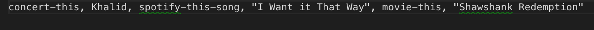
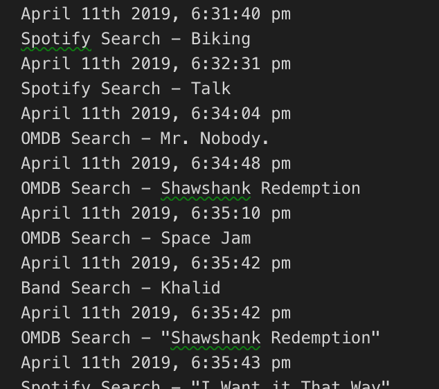

